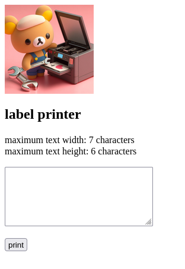

# Phomemo M110 label printer web server



A simple Flask webserver for plain text quick printing on a Phomemo M110 label printer.  
Not security oriented.  
Makes use of one-shot script that connects to the printer via bluetooth and sends raw bytes to print, then disconnects.  
This project is based on:
- [phomemo_printer](https://github.com/hkeward/phomemo_printer)
- [phomemo-tools](https://github.com/vivier/phomemo-tools)

## Setup
First make sure your user can access bluetooth.  
If yes, find your Phomemo M110 printer - MAC address and channel - using your preferred tool.  
Edit `webserver/.env` file according to what you found:  
```
PRINTER_BT_MAC="DE:AD:BE:EF:FE:ED"
PTINER_BT_CHAN="1"
```
You can run the web server manually by entering `webserver` directory, or set it up by creating a systemd service.  
I recommend using virtualenv python module.  
Start by running command below in top level of the repository  
`python -m venv venv && . venv/bin/activate`  
Then install python requirements by running  
`pip install -r requirements.txt`  
Enter into webserver directory:  
`cd webserver`  
Now web server can be directly started by running:  
`python webserver.py`  
It should be available on your machine on port 8081.  
To make it run at startup, assuming you use systemd, first create a file, for example:  
`/etc/systemd/system/phomemo.service`  
```
[Unit]
Description=phomemo

[Service]
ExecStart=/home/user/git/phomemo/venv/bin/python /home/user/git/phomemo/webserver/webserver.py
Restart=always
User=user
Group=user
WorkingDirectory=/home/user/git/phomemo/webserver/

[Install]
WantedBy=multi-user.target
```
Then run:  
`systemctl daemon-reload`  
`systemctl enable phomemo`  
`systemctl start phomemo`  

And finally, make sure that bluetooth and a printer is powered on and the bluetooth device is visible, otherwise you will receive server error.  
If you forgot, just turn on the printer and click F5 -> resend form. It should start printing then.  
This project is just a crude example, but good enough for quick label printing.  
Also, I do not encourage port forwarding this web server to the internet.  
